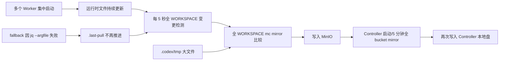

# Issue #1107 文件同步 I/O 放大复现报告与优化方案

## 一、结论

本地环境已经稳定复现 [Issue #1107](https://github.com/agentscope-ai/AgentTeams/issues/1107) 所描述的 **Worker 短时间集中创建后，文件同步 I/O 被放大** 的机制，但没有在本机高速磁盘上复现 MinIO 最终 `offline` 或宿主机硬卡死。

复现得到三个结论：

1. `Controller PIDS=2823` 中的 `PIDS` 是容器内进程和线程数量，不是 Controller 实例数。基线环境中，即使没有新建 Worker，Controller 容器也已有约 854 PIDS，Tuwunel 单独已有约 606 个线程。因此 PIDS 高值得单独治理，但不是本问题的直接根因。
2. Worker 的 Local → Remote 循环存在确定性缺陷：运行时文件在 `.last-pull` 之后持续更新，触发每 5 秒一次的全 HOME `mc mirror`；预期每 5 分钟刷新 `.last-pull` 的 fallback 又因镜像内 jq 1.7 不支持 `--argfile` 而退出，导致循环长期不能收敛。
3. Worker 和 Controller 都使用了范围过大的目录镜像：
   - Worker 会把 `.codex/tmp/**` 等未知 workspace 路径推到对象存储；这些路径是否可丢弃不能由通用同步器判断；
   - Controller 启动时以及每 5 分钟会把整个 storage prefix 拉到本地；
   - 因此临时文件会经历 `Worker 本地 → MinIO → Controller 本地` 的二次写入放大。Worker 数量越多、创建越集中，峰值越明显。

推荐按三个阶段优化：

- **P0：先修正确性**——兼容 jq 1.7，防止 fallback 静默退出；成功 push 后推进独立水位；为同步后台进程增加存活和失败日志。
- **P1：改成通用增量同步**——同步本轮实际变化的文件并合并短时间抖动，变化集合过大时合并为单次 mirror；不依赖 `.codex/tmp` 等运行时特定目录名。
- **P2：拆 Controller 同步职责**——Controller 后台只镜像 `agentteams-config/`，Worker 配置和包操作使用目标路径按需读写，不再周期性拉取整个 bucket。

## 二、复现范围与环境

### 2.1 代码与镜像

复现时拉取的 `origin/main` 为：

```text
5aec8d963157c38c9f9c4088e829d7e91f4ac2e9
```

本地镜像：

```text
agentteams/worker-agent:local-20260730001539
agentteams/agentteams-embedded:local-20260730001539
agentteams/manager-copaw:local-20260730001539
```

容器内关键脚本与该版本 `origin/main` 的 SHA-256 一致：

| 文件 | SHA-256 |
|---|---|
| `worker/scripts/worker-entrypoint.sh` | `3e086716470ce0e3501ad9b4434fc842bece8f5cbfd6773d377a0106fdbf4b04` |
| `manager/scripts/init/start-mc-mirror.sh` | `31e5556fba573011c874ac32495ef5d47bdfac3b2c692f8c0274fb74289363c5` |

Worker 镜像内工具版本：

```text
jq-1.7
mc RELEASE.2025-08-13T08-35-41Z (arm64)
GNU bash 5.2.21
```

### 2.2 隔离方式

复现使用独立的容器、网络、volume 和端口，资源统一使用 `at1107-repro1-*` 前缀，没有修改或停止已有的 `agentteams-*` 环境。

Controller 限制为 4 CPU、8 GiB 内存；Manager 使用 CoPaw，Worker 使用默认 OpenClaw。LLM 使用无效测试密钥，因此本次验证不包含真实会话负载，只覆盖创建和文件同步路径。

测试结束后已删除全部复现容器、网络、volume 和临时目录。

## 三、复现步骤与结果

### 3.1 集中创建四个 Worker

连续执行四次：

```bash
agt create worker --name burst-N --no-wait
```

四个请求约 1 秒内全部被接受，约 21 秒内全部进入 Running。

观察结果：

| 指标 | 结果 |
|---|---|
| Controller 基线 PIDS | 约 854 |
| Tuwunel 基线线程数 | 约 606 |
| Worker 启动 CPU 峰值 | 单 Worker 约 100%–280% |
| Worker 启动内存峰值 | 单 Worker 约 0.7–1.4 GiB |
| Controller CPU 峰值 | 约 145% |
| 对象存储 | 约 6.7 MiB / 566 objects 增至 9.5 MiB / 约 835 objects |

这一步没有自然产生 `.codex/tmp` 大文件，但能够稳定观察到 Worker 每约 5 秒重复执行镜像。日志多次显示：

```text
Total 0 B / Transferred 0 B
```

这里的 `0 B` 只表示没有对象内容需要重新传输，并不表示没有 I/O。`mc mirror` 仍需遍历目录、列举对象、读取元数据并比较差异。

> 注意：Docker `Block I/O` 是容器累计块设备计数，其中包含镜像层读取、进程启动和 MinIO 数据读写，不能把全部增量都归因于文件同步。

### 3.2 受控注入 `.codex/tmp`

在四个 Worker 中分别创建 64 MiB 测试文件：

```text
.codex/tmp/repro/payload.bin
```

总计 256 MiB。

结果：

| 指标 | 注入前 | 注入后 |
|---|---:|---:|
| MinIO bucket | 约 9.5 MiB | 约 266 MiB |
| Controller Block I/O 写入 | 约 303 MB | 约 573 MB |
| 单 Worker 写入 | — | 约 64 MB |
| 完成时间 | — | 约 6 秒 |

说明 `.codex/tmp/**` 当前会被 Worker 同步至对象存储，并形成与 Worker 数量近似线性的写入放大。

### 3.3 重启 Controller

Controller 重启前，本地 `/root/agentteams-fs` 约 11 MiB。重启后约 10 秒恢复健康，本地目录增至约 238 MiB，四个 Worker 的 64 MiB 临时文件全部被拉到 Controller。

`mc-mirror.log` 显示：

```text
265.46 MiB transferred
duration 00m01s
speed 141.60 MiB/s
```

Controller 瞬时 CPU 约 390%。

这证明 Controller 启动时的全 bucket mirror 会把所有 Worker 运行时数据再次复制到 Controller 本地。在低速盘、单盘 MinIO 或更多 Worker 同时写入的环境中，这一行为会显著放大 I/O 峰值。

### 3.4 七分钟静置观察

静置超过 7 分钟后：

- 四个 Worker 的 `.last-pull` 仍停留在启动时间；
- Local → Remote 循环仍约每 5 秒运行一次；
- 每个 Worker 的 fallback 子进程均变成 `[worker-entrypoi] <defunct>`；
- `find "$WORKSPACE" -type f -newer "$PULL_MARKER"` 持续命中 OpenClaw 运行时文件。

命中的典型文件包括：

```text
.openclaw/logs/config-health.json
.openclaw/identity/*
.openclaw/tasks/*.sqlite
.openclaw/tasks/*.sqlite-wal
.openclaw/tasks/*.sqlite-shm
.openclaw/devices/*
.openclaw/models/*
```

## 四、源码根因分析

### 4.1 `.last-pull` 不是远端增量游标

Worker 启动完成后仅执行：

```bash
PULL_MARKER="${WORKSPACE}/.last-pull"
touch "${PULL_MARKER}"
```

Local → Remote 循环使用本地 mtime 判断是否有变化：

```bash
find "${WORKSPACE}/" -type f -newer "${PULL_MARKER}"
```

因此 `.last-pull` 只是一个本地时间水位，不记录远端对象版本、ETag 或已传输对象集合。更新它不会让后续 `mc mirror` 自动变成真正的对象级增量；它只能避免在没有更新文件时调用 `mc mirror`。

当前实现还有两个问题：

1. 检测使用整个 `${WORKSPACE}`，但真正 mirror 时排除了部分目录。只要被 mirror 排除的运行时文件持续更新，检测仍会反复触发。
2. 成功 push 后不更新 marker。即使第一次 mirror 已完成，同一个新文件仍会在之后每 5 秒触发一次全目录比较。

对应源码：

- [`worker/scripts/worker-entrypoint.sh`](../worker/scripts/worker-entrypoint.sh)：初始 pull、`.last-pull`、5 秒检测和 5 分钟 fallback。
- [`manager/agent/worker-agent/skills/file-sync/scripts/agentteams-sync.sh`](../manager/agent/worker-agent/skills/file-sync/scripts/agentteams-sync.sh)：按需 pull 同样刷新 `.last-pull`。

### 4.2 5 分钟 fallback 因 jq 参数不兼容退出

fallback 调用：

```bash
merge_openclaw_config /tmp/openclaw-remote.json "${WORKSPACE}/openclaw.json"
```

merge helper 使用：

```bash
jq -n --argfile remote ... --argfile local ...
```

实际 Worker 镜像中的 jq 1.7 不提供 `--argfile`，直接返回：

```text
jq: Unknown option --argfile
```

[`shared/lib/merge-openclaw-config.sh`](../shared/lib/merge-openclaw-config.sh) 虽然在命令替换后检查 `$?`，但调用方脚本启用了 `set -e`；jq 失败会使后台 subshell 在执行检查和 `touch .last-pull` 之前退出，最终留下 zombie。

这是本次复现中“同步循环超过 5 分钟仍不能收敛”的确定性原因。

### 4.3 Worker 的检测范围、拉取范围和推送范围不一致

当前三套范围如下：

| 操作 | 范围 |
|---|---|
| 变更检测 | `${WORKSPACE}` 下全部普通文件，无排除 |
| 初始 pull | 整个 Worker prefix，仅排除 Matrix、canvas、credentials |
| Local → Remote push | 整个 Worker workspace，排除部分缓存和配置 |

`.codex/tmp/**` 在初始 pull 和 push 中都没有排除，因此它既会进入 MinIO，也会在 Worker 重建时重新拉回。本次使用它只是因为该目录能够稳定构造大文件负载，不能据此认定其中的数据没有业务价值。

将 `.codex/tmp/**` 硬编码为排除项不具备运行时通用性：OpenClaw、CoPaw、Hermes、OpenHuman 以及 Worker 调用的其他工具，都可能产生各自的目录结构；名称包含 `tmp` 也不能证明内容允许丢失。优化的默认前提应是保留现有同步语义，通过减少重复扫描和重复比较降低 I/O，而不是猜测哪些目录可以删除或忽略。

### 4.4 Controller 同步职责过宽

[`manager/scripts/init/start-mc-mirror.sh`](../manager/scripts/init/start-mc-mirror.sh) 当前执行：

```bash
# 启动时
mc mirror "${AGENTTEAMS_STORAGE_PREFIX}/" "${AGENTTEAMS_FS_ROOT}/" --overwrite

# 每 5 分钟
mc mirror "${AGENTTEAMS_STORAGE_PREFIX}/" "${AGENTTEAMS_FS_ROOT}/" \
  --overwrite --newer-than "5m"
```

但 Controller 的 [`FileWatcher`](../agentteams-controller/internal/watcher/file_watcher.go) 只监听：

```text
/root/agentteams-fs/agentteams-config/
```

Controller 的 package/deployer 逻辑确实还会使用 `/root/agentteams-fs/agents/<worker>` 作为目标 Worker 的本地 staging，但这只能说明相关操作需要目标目录，不代表后台必须复制所有 Worker 的全部运行时状态。

因此当前脚本混合了三种职责：

- Controller 控制面配置同步；
- Manager 对 Worker/共享文件的可见性；
- Worker 包和配置操作的临时 staging。

在拆分这些职责之前，不能简单删除整个 mirror；但可以先验证并收窄 Controller 常驻同步范围。

## 五、I/O 放大链路



短时间创建多个 Worker 不是必要条件，但会让上述独立循环在时间上重叠，因此更容易触发磁盘吞吐和队列深度峰值。

## 六、优化方案

### 6.1 P0：修复同步循环正确性

目标：先让现有机制能够稳定停止无效 mirror，不改变持久化模型。

#### 6.1.1 兼容 jq 1.7

将 `--argfile` 改为 jq 1.7 支持的 `--slurpfile`，并显式取数组首项：

```jq
($remote[0]) as $remote
| ($local[0]) as $local
| ...
```

不要使用 `--argjson "$(cat file)"`，避免大配置进入命令行参数并受 argv 长度限制。

同时把命令替换写成显式条件：

```bash
if merged=$(jq ...); then
    printf '%s\n' "${merged}" > "${output_path}"
else
    return 1
fi
```

调用方必须用 `if ! merge_openclaw_config ...; then log ...; fi` 处理失败，避免 `set -e` 杀死后台循环。

#### 6.1.2 成功 push 后推进独立水位

P0 不新增任何运行时目录排除规则。先把 `.last-pull` 的两个职责拆开，增加 `last-successful-push`：

1. 开始 mirror 前记录 `cycle-start`；
2. mirror 和单文件 push 全部成功后，将 `last-successful-push` 原子更新为 `cycle-start`；
3. 同步期间再次变化的文件仍比水位新，会留到下一轮；
4. 失败时不推进水位。

这能直接消除“同一批变化文件永久触发 5 秒 mirror”的问题，同时保留包括 `.codex/tmp/**` 在内的现有同步语义。

#### 6.1.3 后台循环可观测

- 每次 merge/mirror 失败输出 Worker、方向、耗时和退出码；
- 记录两个后台 PID，并检测异常退出；
- 退出时由父进程记录明确错误，不能只留下 `<defunct>`；
- 对连续失败增加有上限的指数退避和 jitter，避免多个 Worker 同步重试同频共振。

### 6.2 P1：按变化集合增量传输

建议不再让一个 marker 同时表达“最近 pull”和“最近成功 push”。改为：

```text
.agentteams-sync/last-successful-push
.agentteams-sync/last-manager-pull
```

marker 目录必须排除在同步范围外。

Local → Remote 每轮算法：

1. 在扫描前创建 `cycle-start` 临时 marker；
2. 对连续写入增加短暂 debounce，把同一轮变化合并；
3. 生成 `last-successful-push < mtime <= cycle-start` 的文件清单；
4. 变化集合较小时按相对路径逐文件上传；变化集合超过经压测确定的阈值时，本轮只执行一次全量 mirror，避免大量 `mc cp` 进程产生反向开销；
5. 本轮文件全部成功后，把 `last-successful-push` 原子替换为 `cycle-start`；
6. 任一操作失败则不推进水位；
7. push 期间新写入的文件比 `cycle-start` 新，下一轮仍会被发现；
8. 不增加固定周期的全量 mirror，避免集中创建的 Worker 在相同周期再次形成 I/O 尖峰；如后续要求传播删除，应增加显式 tombstone/变更日志，而不是恢复全 HOME 轮询。

不能在 mirror 完成时简单 `touch marker`，否则 mirror 过程中产生但未被复制的文件可能被错误跳过。

#### 6.2.1 同步策略与运行时解耦

核心同步器默认同步所有 Worker 文件，不识别 `.codex`、`.openclaw`、`.copaw` 等运行时目录。

只有某个运行时明确声明了可丢弃路径，并且满足“Worker 重建后不需要恢复、丢失不影响任务、目录不承载用户产物”三个条件时，才能通过运行时自己的同步契约增加排除规则。该契约应由运行时镜像维护，而不是散落在通用 Worker 同步脚本中。

这样可以同时满足：

- 未知工具和未来 Worker runtime 默认不会丢数据；
- 高频变化只传实际变化文件，不会反复扫描整个 HOME；
- 后续确有证据时，仍可对某个 runtime 做有边界的进一步优化。

### 6.3 P2：缩小 Controller 常驻镜像范围

Controller 常驻路径建议改为：

```text
MinIO agentteams-config/
        ↓
/root/agentteams-fs/agentteams-config/
        ↓
FileWatcher
```

具体改造：

1. `start-mc-mirror.sh` 增加明确的运行角色，Embedded Controller 启动时只拉 `agentteams-config/`；
2. 删除 Controller 每 5 分钟的全 storage prefix mirror；
3. package/import/config 操作按 Worker 目标路径读写，使用独立 staging 目录，例如：

   ```text
   /var/lib/agentteams-controller/staging/agents/<worker>
   ```

4. Manager 如需读取 Worker 结果，应通过现有 Matrix 通知触发目标路径 pull，fallback 也只扫描 `shared/` 和明确的 `agents/<worker>`，不依赖 Controller 的本地副本；
5. Controller 健康启动不能等待整个 bucket 下载完成。

该阶段改动前必须回归 Worker package/import/config 流程，因为 [`agentteams-controller/internal/executor/package.go`](../agentteams-controller/internal/executor/package.go) 当前直接使用 `/root/agentteams-fs/agents/<worker>`。

### 6.4 P3：存储侧保护与历史数据治理

- 为 MinIO 数据盘单独设置容量、延迟和队列深度告警；
- 记录同步扫描次数、传输对象数、传输字节数、耗时、失败次数、退避状态、marker 年龄；
- 区分“扫描比较 0 B”和“完全没有调用 mirror”；
- 如运行时已经提供明确的数据分类契约，可提供对应的历史对象清理工具：
  - 默认 dry-run；
  - 按 Worker 和前缀列出对象数、大小；
  - 显式确认后删除；
  - 不碰未知业务目录。

应用层优化可以减少放大，但不能保证单盘 MinIO 在底层磁盘长时间不可用时永不 `offline`。这部分仍需存储健康检查、超时、降级和告警配合。

## 七、测试与验收

### 7.1 Shell 单元测试

使用 fake `mc` 和 jq 1.7 覆盖：

1. `merge_openclaw_config` 在 jq 1.7 下合并结果正确；
2. 远端 JSON 非法时保留本地文件，fallback 不退出、不产生 zombie；
3. 任意未知目录下的文件都能被同步，不依赖运行时目录白名单；
4. 一个文件更新只触发一次增量上传，成功后推进水位；
5. 高频连续写入会被合并，不会每 5 秒扫描和比较整个 HOME；
6. 传输期间产生的新文件下一轮仍会同步；
7. 传输失败不推进水位，并进入退避；
8. 大变化集合只触发一次 mirror，不产生大量独立上传进程。

当前仓库未发现覆盖 `merge_openclaw_config`、`.last-pull` 或 Worker 后台同步循环的测试，P0 必须先补这一层。

### 7.2 Controller 回归

1. Controller 启动只请求 `agentteams-config/`，不请求 storage prefix 根目录；
2. 创建 Worker、导入 package、更新配置仍成功；
3. bucket 中预置大体积 `agents/<worker>/.codex/tmp/**` 后重启 Controller，不产生对应下载；这里验证的是 Controller 同步范围，而不是认定该目录可丢弃；
4. FileWatcher 仍能在 10 秒轮询窗口内 reconcile YAML。

### 7.3 Issue 场景验收

固定回归场景：

1. 1 秒内创建 4 个 Worker；
2. 每个 Worker 生成 64 MiB `.codex/tmp`；
3. 静置 10 分钟；
4. 重启 Controller。

验收标准：

- `.codex/tmp/**` 作为普通未知业务路径能够正确上传，但同一版本只上传一次；
- Worker 静置后不再每 5 秒执行全 HOME mirror；
- 两个后台同步循环均存活，无 zombie；
- Controller 重启不读取任何 `agents/*/.codex/tmp/**`；
- Controller 只产生与 `agentteams-config/` 规模匹配的下载；
- Worker 创建、配置更新、任务文件同步和重建恢复不回退；
- Controller、MinIO、Tuwunel 健康检查持续成功。

## 八、实施顺序与回滚

| 阶段 | 改动 | 风险 | 回滚 |
|---|---|---|---|
| P0 | jq 兼容、独立 push 水位、后台错误可见 | 低 | 回滚 Worker 镜像 |
| P1 | 变化集合增量上传、debounce、大集合单次 mirror | 中 | 恢复旧同步循环；不涉及远端数据迁移 |
| P2 | Controller 只同步控制面、目标路径 staging | 中高 | 恢复 Controller 镜像；保留原 bucket |
| P3 | 指标、告警、显式历史清理 | 低至中 | 停止清理工具；不自动回滚已确认删除的数据 |

建议每个阶段独立 PR、独立镜像验证。P0 可以立即实施；P1 和 P2 不应合并在同一个 PR 中。

## 九、待确认的持久化契约

进入 P1 前需要明确：

1. 低频全量校准的周期和允许的最大远端滞后是多少？
2. 删除和重命名是否要求实时传播，还是允许由低频校准处理？
3. Manager 是否真的需要本地持有所有 Worker 的完整目录，还是只需按通知拉取目标 Worker 的结果？
4. Worker package/import 流程能否全部改为独立 staging，而不直接操作 Controller 的长期 mirror？

这些问题不影响 P0；它们决定 P1 的一致性窗口和 P2 的职责拆分边界。

## 十、实现与本地回归结果

2026-07-30 已按本方案完成第一轮实现，并使用隔离镜像和容器复跑 Issue 场景。

测试镜像：

```text
agentteams/agentteams-controller:local-20260730153542
agentteams/agentteams-embedded:local-20260730153542
agentteams/worker-agent:local-20260730153542
```

实现内容：

- jq merge 改用 jq 1.7 支持的 `--slurpfile`，失败由调用方显式处理；
- Worker 使用独立的成功 push 水位；
- 小变化集合按相对路径逐文件上传，大变化集合合并为一次 mirror；
- 未知 workspace 路径默认同步，没有硬编码排除 `.codex/tmp/**`；
- push 失败或 workspace 扫描失败不推进水位；
- fallback pull 与 push 并发时，水位只能单调前进；
- embedded Controller 只镜像 `agentteams-config/`；
- legacy all-in-one Manager 保留原 full mirror 行为。

回归结果：

| 验证项 | 结果 |
|---|---|
| 4 个 OpenClaw Worker 集中创建 | 1 秒内全部提交，最终全部 Running |
| 测试载荷 | 每个 Worker 64 MiB，共 256 MiB |
| 未知路径同步 | 四个 `.codex/tmp/repro/payload.bin` 均正常上传 |
| 重复上传 | 静置 30 秒后四个对象的 ETag 和 Last-Modified 均未变化 |
| 按需恢复 | `agentteams-sync` 能重新拉回 64 MiB 测试文件 |
| 5 分钟 fallback | 四个 Worker 的 `.last-pull` 均刷新，两个同步子进程保持运行 |
| Controller 重启 | bucket 约 278 MB，本地目录重启前后均为约 11 MB |
| Controller 重启传输 | 只拉取 `agentteams-config` 的 3 B |
| Worker 临时载荷进入 Controller | 未发现 |
| 服务状态 | Controller、MinIO、Tuwunel 健康；四个 Worker 保持 Running |

Controller 重启期间，一个 Worker 记录过一次 Local → Remote 失败；MinIO 恢复后同一变化自动重试成功，符合“失败不推进水位”的预期。

与原复现相比，两个主要放大环节都已消除：

1. 同一个 Worker 文件不会每 5 秒触发一次全 HOME 远端比较；
2. embedded Controller 重启不会再次下载全部 Worker workspace。
