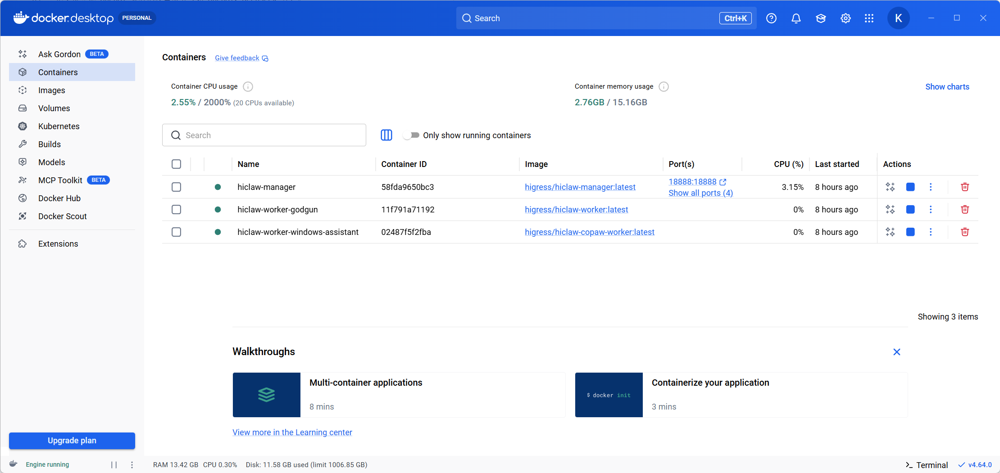
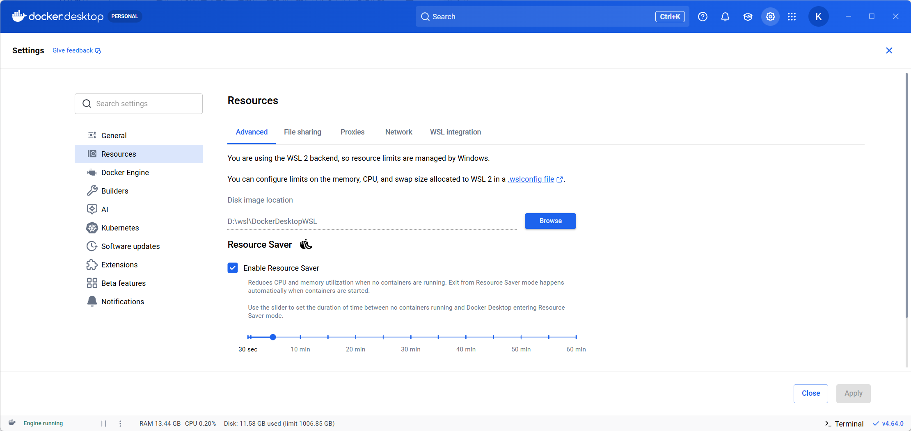
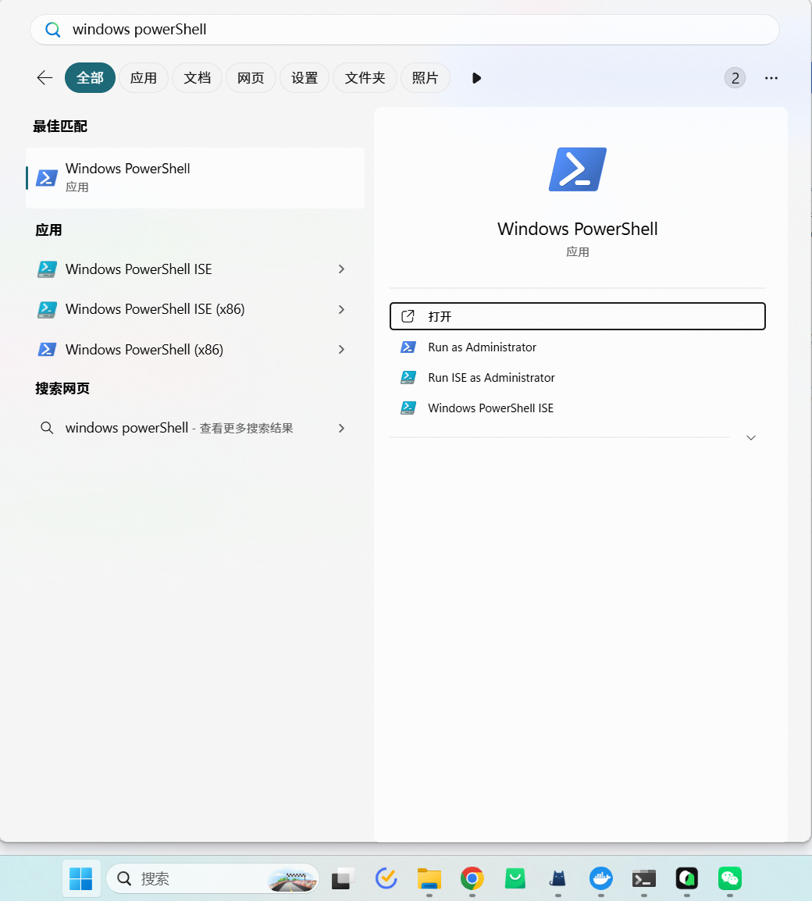
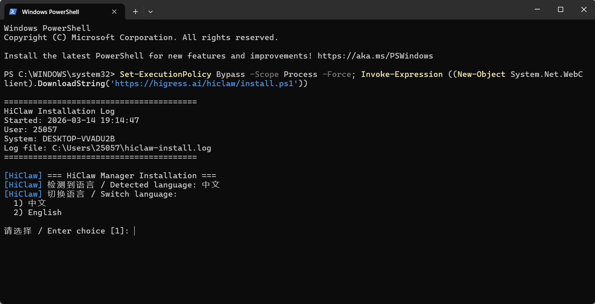
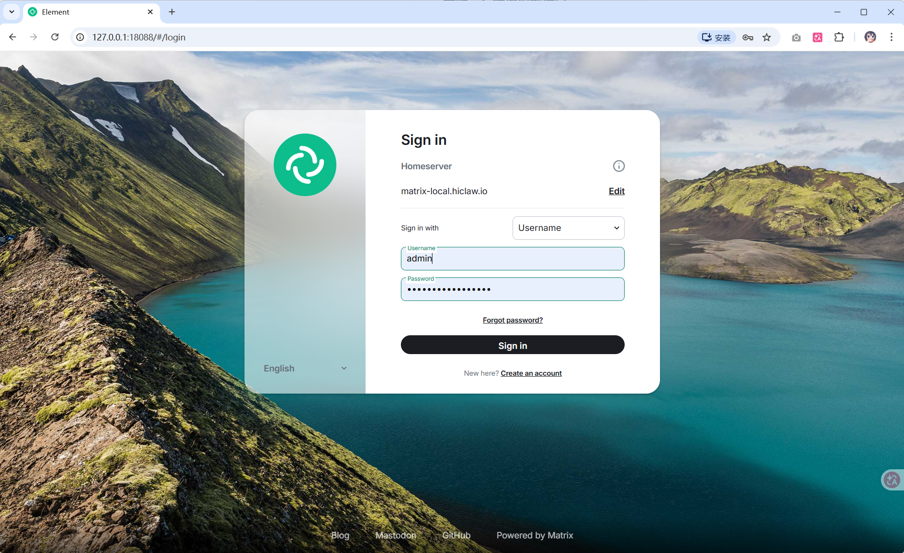
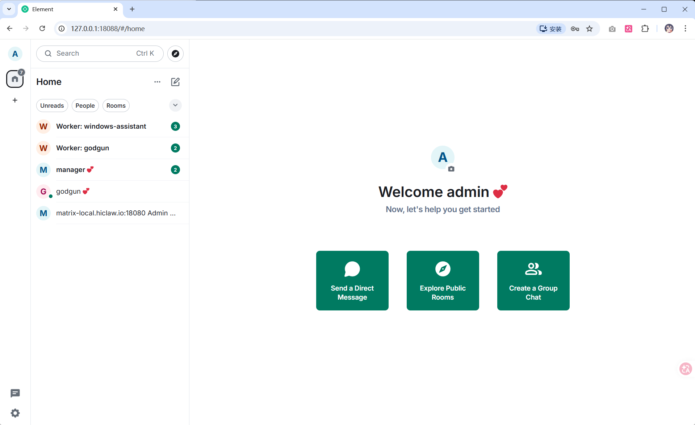

# AgentTeams Windows Deployment Guide

This guide explains how to deploy AgentTeams multi-agent collaboration platform on Windows. Even if you're new to Docker and Agent systems, you can complete the installation by following this guide.

---

## Table of Contents

- [Prerequisites](#prerequisites)
  - [Operating System Requirements](#operating-system-requirements)
  - [Hardware Requirements](#hardware-requirements)
  - [Software Dependencies](#software-dependencies)
  - [Getting an API Key](#getting-an-api-key)
- [Step 1: Install and Start Docker Desktop](#step-1-install-and-start-docker-desktop)
- [Step 2: Run the Installation Script](#step-2-run-the-installation-script)
- [Step 3: Select Language](#step-3-select-language)
- [Step 4: Select Installation Mode](#step-4-select-installation-mode)
- [Step 5: Select LLM Provider](#step-5-select-llm-provider)
- [Step 6: Select Model Interface](#step-6-select-model-interface)
- [Step 7: Select Model Series](#step-7-select-model-series)
- [Step 8: Enter API Key and Test Connectivity](#step-8-enter-api-key-and-test-connectivity)
- [Step 9: Select Network Access Mode](#step-9-select-network-access-mode)
- [Step 10: Confirm Port and Domain Configuration](#step-10-confirm-port-and-domain-configuration)
- [Step 11: Optional Configuration](#step-11-optional-configuration)
- [Step 12: Select Worker Runtime](#step-12-select-worker-runtime)
- [Step 13: Wait for Installation to Complete](#step-13-wait-for-installation-to-complete)
- [Step 14: Log in to Element Web and Get Started](#step-14-log-in-to-element-web-and-get-started)
- [Upgrade](#upgrade)
- [Uninstall](#uninstall)
- [FAQ](#faq)

---

## Prerequisites

### Operating System Requirements

- Windows 10 (64-bit) version 1903 or later, or Windows 11
- WSL 2 (Windows Subsystem for Linux 2) must be enabled. Docker Desktop will prompt you to enable it during installation
- **Not supported**: Windows running in a virtual machine (VM), because VMs cannot run Linux Containers

### Hardware Requirements

| Configuration | Minimum | Recommended |
|---------------|---------|-------------|
| CPU | 2 cores | 4 cores or more |
| Memory | 4 GB | 8 GB or more |
| Disk | 10 GB free space | 20 GB or more |

> **Note**: If you plan to deploy multiple Worker Agents for more powerful Agent Teams capabilities, we recommend 4 cores and 8 GB RAM or higher. The OpenClaw runtime uses approximately 500MB memory per Worker, QwenPaw about 150MB, and Hermes is typically between the two depending on workload.

### Software Dependencies

| Software | Requirement | Download |
|----------|-------------|----------|
| Docker Desktop | 4.20+ | https://www.docker.com/products/docker-desktop/ |
| PowerShell | 7.0+ (recommended) | https://learn.microsoft.com/en-us/powershell/scripting/install/installing-powershell-on-windows |

> **Note**: Windows comes with PowerShell 5.1 pre-installed, but we recommend upgrading to PowerShell 7.0+ for better compatibility and features.

### Getting an API Key

AgentTeams requires an LLM API Key to power the Agent's intelligent behavior. We recommend using Alibaba Cloud Bailian:

1. Visit [Alibaba Cloud Bailian](https://www.aliyun.com/product/bailian), register or log in to your Alibaba Cloud account
2. Enable Bailian service and obtain an API Key
3. (Recommended) Enable [CodingPlan](https://bailian.console.aliyun.com/cn-beijing/?source_channel=4qjGAvs1Pl&tab=coding-plan#/efm/index) service for better performance in coding scenarios

Other OpenAI-compatible model services (such as OpenAI, DeepSeek, etc.) are also supported.

---

## Step 1: Install and Start Docker Desktop

1. Download [Docker Desktop for Windows](https://www.docker.com/products/docker-desktop/)
2. Double-click the installer and follow the wizard. If prompted to enable WSL 2 during installation, confirm to enable it
3. After installation completes, start Docker Desktop
4. Wait for the green icon in the bottom-left corner of Docker Desktop (Engine running), indicating the Docker engine is ready



> **Note**: Docker Desktop takes some time to start. Wait until the bottom-left status turns green before proceeding.

5. (Optional) Verify memory allocation: Newer Docker Desktop versions (v4.20+) using the WSL 2 backend have memory managed automatically by Windows, typically requiring no manual configuration. If you encounter Manager Agent startup timeout later, you can adjust WSL 2 memory allocation via the `.wslconfig` file:

   Run in PowerShell:
   ```powershell
   notepad "$env:USERPROFILE\.wslconfig"
   ```

   Add the following content (adjust as needed), save and restart Docker Desktop:
   ```ini
   [wsl2]
   memory=8GB
   ```



---

## Step 2: Run the Installation Script

1. Click the Windows Start menu, search for or select **Windows PowerShell**



2. In the PowerShell window, copy and paste the following command, then press Enter:

```powershell
Set-ExecutionPolicy Bypass -Scope Process -Force; $wc=New-Object Net.WebClient; $wc.Encoding=[Text.Encoding]::UTF8; iex $wc.DownloadString('https://raw.githubusercontent.com/agentscope-ai/AgentTeams/main/install/agentteams-install.ps1')
```

> **Note**: This command temporarily allows the current PowerShell window to execute scripts (without affecting system security policy), then downloads and runs the AgentTeams installation script from the network.

After the installation script starts, you'll see the AgentTeams installation wizard. Follow the terminal prompts to proceed.



---

## Step 3: Select Language

The script automatically detects the system timezone and recommends a language. When you see:

```
Detected language / Detected language: 中文
Switch language / Switch language:
  1) 中文
  2) English

Enter choice / Enter choice [1]:
```

Enter `2` to select English (or press Enter to use the default), then press Enter to confirm.

---

## Step 4: Select Installation Mode

```
--- Onboarding Mode ---

Select installation mode:
  1) Quick Start  - Quick install using Alibaba Cloud Bailian (Recommended)
  2) Manual Setup - Choose LLM provider and customize options

Enter choice [1/2]:
```

- **Quick Start** (Recommended): Uses Alibaba Cloud Bailian with mostly default settings, only requiring an API Key
- **Manual Setup**: Customize LLM provider selection and configure each option manually

For beginners, we recommend selecting `1` for Quick Start.

---

## Step 5: Select LLM Provider

```
Available LLM Providers:
  1) Alibaba Cloud Bailian  - Recommended for users in China
  2) OpenAI Compatible API  - Custom Base URL (OpenAI, DeepSeek, etc.)

Select provider [1/2]:
```

- Select `1`: Use Alibaba Cloud Bailian (recommended for users in China)
- Select `2`: Use OpenAI, DeepSeek, or other providers compatible with OpenAI API protocol. You'll need to manually enter the Base URL

---

## Step 6: Select Model Interface

If you selected Alibaba Cloud Bailian in the previous step, you'll see this submenu:

```
Select Bailian Model Series:
  1) CodingPlan  - Optimized for coding tasks (Recommended)
  2) Bailian General Interface

Select model series [1/2]:
```

- **CodingPlan** (Recommended): An interface optimized for coding tasks with better performance. Requires separate activation at: [CodingPlan](https://bailian.console.aliyun.com/cn-beijing/?source_channel=4qjGAvs1Pl&tab=coding-plan#/efm/index)
- **Bailian General Interface**: Bailian's general model interface

---

## Step 7: Select Model Series

If you selected CodingPlan in the previous step, a model selection menu appears:

```
Select CodingPlan Default Model:
  1) qwen3.5-plus  - Qwen 3.5 (Fastest)
  2) glm-5  - Zhipu GLM-5 (Recommended for coding)
  3) kimi-k2.5  - Moonshot Kimi K2.5
  4) MiniMax-M2.5  - MiniMax M2.5

Select model [1/2/3/4]:
```

Choose based on your needs. After installation, you can also switch models via Manager chat commands.

---

## Step 8: Enter API Key and Test Connectivity

The script will prompt you to enter your API Key:

```
  Hint: Get Alibaba Cloud Bailian API Key:
     https://www.aliyun.com/product/bailian

LLM API Key: ****
```

Paste your API Key (input won't display in plain text, this is normal), then press Enter to confirm.

The script will automatically test API connectivity. If successful, you'll see:

```
[AgentTeams] API connectivity test passed
```

> **If the test fails**:
> - Check if the API Key was pasted completely without extra spaces
> - Confirm the corresponding model service is enabled (e.g., CodingPlan requires separate activation)
> - Verify network access to Alibaba Cloud API services
> - If multiple attempts fail, consider submitting a support ticket to the model provider

---

## Step 9: Select Network Access Mode

```
--- Network Access Mode ---

  1) Local only, no external ports (Recommended)
  2) Allow external access (LAN / Public Internet)

Enter choice [1/2]:
```

- Select `1` (Recommended): Ports bind to `127.0.0.1`, accessible only from the local machine, more secure
- Select `2`: Ports bind to `0.0.0.0`, accessible from other devices on the LAN. Suitable for mobile access or sharing with colleagues

> **Security Note**: If you allow external access, we recommend configuring TLS certificates and enabling HTTPS in the Higress console to avoid plaintext transmission.

---

## Step 10: Confirm Port and Domain Configuration

The script will prompt for the following configurations one by one. **Just press Enter to use default values** - no manual changes needed:

| Configuration | Default | Description |
|---------------|---------|-------------|
| Gateway Host Port | 18080 | Higress gateway port |
| Higress Console Port | 18001 | Management console |
| Element Web Port | 18088 | IM client access port |
| OpenClaw Console Port | 18888 | Agent console |
| Matrix Domain | matrix-local.agentteams.io:18080 | Matrix server domain |
| Element Web Domain | matrix-client-local.agentteams.io | IM client domain |
| AI Gateway Domain | aigw-local.agentteams.io | AI gateway domain |
| File System Domain | fs-local.agentteams.io | MinIO file system domain |
| OpenClaw Console Domain | console-local.agentteams.io | Agent console domain |

> **Note**: These domains are automatically resolved to `127.0.0.1` for local deployment, no manual DNS or hosts file configuration needed.

---

## Step 11: Optional Configuration

The following configurations can be skipped by pressing Enter to use default values:

| Configuration | Description | Default |
|---------------|-------------|---------|
| GitHub Personal Access Token | Used by Workers for GitHub operations (PRs, Issues, etc.) | Leave empty to skip |
| Skills Registry URL | Source for Workers to get skills | https://skills.sh |
| Docker Volume Name | Persistent data storage | agentteams-data |
| Manager Workspace Directory | Stores Agent configs and state | `%USERPROFILE%\agentteams-manager` |

---

## Step 12: Select Worker Runtime

```
--- Default Worker Runtime ---

  1) OpenClaw (Node.js, ~500MB memory typical)
  2) QwenPaw (Python, ~150MB typical; internal image name: copaw)
  3) Hermes (Python Hermes worker runtime)

Enter choice [1/2/3]:
```

| Runtime | Memory (typical) | Features |
|---------|------------------|----------|
| OpenClaw | ~500MB | Feature-rich, built-in Web console |
| QwenPaw | ~150MB | Lightweight Python runtime |
| Hermes | Varies | Hermes policy tree under `.hermes/` in the worker workspace |

Choose based on your machine configuration and the kind of tasks you expect Workers to run.

---

## Step 13: Wait for Installation to Complete

After making your selections, the script will automatically:

1. Generate configuration files and keys
2. Pull the **embedded controller**, **Manager**, and default **Worker** images (first-time install is typically a few GB depending on network speed)
3. Create and start **`agentteams-controller`** (infrastructure + controller)
4. Wait for the controller to create **`agentteams-manager`**
5. Wait for Manager Agent to be ready
6. Wait for Matrix service to be ready
7. Send initialization message

```
[AgentTeams] Pulling embedded controller image: .../agentteams-embedded:...
[AgentTeams] Pulling Manager image: .../agentteams-manager:latest
[AgentTeams] Pulling Worker image: .../agentteams-worker:latest
[AgentTeams] Starting controller container...
[AgentTeams] Waiting for Manager Agent container...
[AgentTeams] Manager Agent is ready!
[AgentTeams] Waiting for Matrix service ready (timeout: 300s)...
[AgentTeams] Matrix service is ready!
```

After successful installation, you'll see a panel with login information:

```
===============================================================
  Open the following URL in your browser to get started:

    http://127.0.0.1:18088/#/login

  Login credentials:
    Username: admin
    Password: admin<random-string>

  After login, start chatting with Manager!
    Tell it: "Create a frontend developer Worker named alice"
    Manager will handle everything automatically.
===============================================================
```

> **Be sure to record your username and password** - the password is an auto-generated random string. Configuration is saved in `%USERPROFILE%\agentteams-manager.env` and can be viewed at any time.

---

## Step 14: Log in to Element Web and Get Started

1. Open a browser and visit http://127.0.0.1:18088/#/login
2. Enter the username and password from the previous step
3. After logging in, you'll see a conversation window with Manager
4. Send a message in the chat box to start interacting with Manager





**Quick Start**: Send the following message to have Manager create your first Worker:

```
Create a frontend developer Worker named alice
```

Manager will automatically:
- Register alice's Matrix account
- Create a Consumer in Higress (with security credentials)
- Generate configuration files in MinIO
- Create a三方 room (you, Manager, alice)
- Start the Worker container

Once created, you can assign tasks directly in alice's room.

### Mobile Access (Optional)

If you selected "Allow external access" during installation, you can manage your Agent team anytime, anywhere using a Matrix client on your phone (FluffyChat or Element Mobile):

1. Download FluffyChat or Element on your phone
2. Set the homeserver to: `http://<your-computer-lan-ip>:18080`
3. Log in with the username and password from installation

---

## Upgrade

When a new version is released, simply re-run the installation command in PowerShell to upgrade in-place:

```powershell
Set-ExecutionPolicy Bypass -Scope Process -Force; $wc=New-Object Net.WebClient; $wc.Encoding=[Text.Encoding]::UTF8; iex $wc.DownloadString('https://raw.githubusercontent.com/agentscope-ai/AgentTeams/main/install/agentteams-install.ps1')
```

When the installation script detects an existing installation, it will prompt you to choose:

- **In-place upgrade** (Recommended): Preserves all data, configuration, and workspaces, only updates container images
- **Clean reinstall**: Deletes all data and starts fresh

> During upgrade, **`agentteams-controller`**, **`agentteams-manager`**, and Worker containers may be recreated. Workers are stateless — data in MinIO / the Docker volume is preserved according to your upgrade choices.

To upgrade to a specific version:

```powershell
$env:AGENTTEAMS_VERSION="v1.0.5"; Set-ExecutionPolicy Bypass -Scope Process -Force; $wc=New-Object Net.WebClient; $wc.Encoding=[Text.Encoding]::UTF8; iex $wc.DownloadString('https://raw.githubusercontent.com/agentscope-ai/AgentTeams/main/install/agentteams-install.ps1')
```

---

## Uninstall

Run the following command in PowerShell to stop and remove all AgentTeams containers, Docker volumes, and configuration files:

```powershell
Set-ExecutionPolicy Bypass -Scope Process -Force; Invoke-Expression "& { $(Invoke-WebRequest -Uri 'https://raw.githubusercontent.com/agentscope-ai/AgentTeams/main/install/agentteams-install.ps1' -UseBasicParsing).Content } uninstall"
```

This mirrors `install/agentteams-install.sh uninstall`: **`agentteams-controller`**, **`agentteams-manager`**, Worker containers, optional **`agentteams-docker-proxy`**, the data volume, env file, network, etc.

> **Note**: Uninstallation may preserve the Manager workspace directory (`%USERPROFILE%\agentteams-manager`) depending on script version — delete it manually if you want every host-side file removed.

---

## FAQ

### PowerShell Script Execution Closes Immediately

**Symptom**: The PowerShell window closes immediately after executing the installation command.

**Troubleshooting Steps**:
1. Confirm Docker Desktop is installed and fully started (green icon in bottom-left)
2. Right-click the Start menu → Open **Windows PowerShell** (not CMD Command Prompt)
3. First run `docker info` manually to confirm Docker is working
4. Then run the AgentTeams installation command

### Docker Desktop Not Running

**Symptom**: Error message `Docker is not running. Please start Docker Desktop or Podman Desktop first.`

**Solution**: Start Docker Desktop and wait for the bottom-left icon to turn green, then retry.

### Image Pull Timeout

**Symptom**: Installation is stuck at the image pull stage for a long time.

**Solution**:
- The installation script automatically selects the nearest mirror repository based on timezone (users in China use the Hangzhou node), usually no additional configuration needed
- If you have a special network environment, you can configure a mirror accelerator in Docker Desktop → **Settings** → **Docker Engine**

### API Connectivity Test Failed

**Symptom**: Installation shows `API connectivity test failed`.

**Troubleshooting Steps**:
1. Confirm the API Key was pasted completely without extra spaces
2. If using CodingPlan, confirm CodingPlan service is enabled: [Activation Link](https://bailian.console.aliyun.com/cn-beijing/?source_channel=4qjGAvs1Pl&tab=coding-plan#/efm/index)
3. Visit https://dashscope.aliyuncs.com in a browser to confirm network reachability
4. If multiple attempts fail, you can choose to continue installation (the script will ask), then reconfigure in the Higress console after installation

### Manager Agent Startup Timeout

**Symptom**: Installation log is stuck at `Waiting for Manager Agent ready...` for more than 5 minutes.

**Troubleshooting Steps**:
1. Check if WSL 2 has insufficient available memory. New Docker Desktop versions use the WSL 2 backend with memory managed by Windows. Run `wsl --status` in PowerShell to check configuration. To increase, edit `%USERPROFILE%\.wslconfig`, set `memory=8GB`, save and restart Docker Desktop
2. View **controller** logs (provisions Manager in v1.1+):
   ```powershell
   docker logs agentteams-controller
   ```
3. View Manager container logs:
   ```powershell
   docker logs agentteams-manager
   ```
4. View detailed Agent logs:
   ```powershell
   docker exec agentteams-manager cat /var/log/agentteams/manager-agent.log
   ```

### Port Already in Use

**Symptom**: Installation successful but cannot access Element Web.

**Troubleshooting Steps**:
1. Check if port 18088 is occupied by another program:
   ```powershell
   netstat -ano | findstr "18088"
   ```
2. If the port is occupied, reinstall using "Manual Setup" mode and change the port number

### How to View Current Installation Configuration

Configuration is saved in the following locations:

| File | Location | Description |
|------|----------|-------------|
| Environment Variables | `%USERPROFILE%\agentteams-manager.env` | All installation config (including password) |
| Manager Workspace | `%USERPROFILE%\agentteams-manager\` | Agent configs, skills, memory |
| Installation Log | `%USERPROFILE%\agentteams-install.log` | Complete installation process log |

View password in PowerShell:

```powershell
Select-String "AGENTTEAMS_ADMIN_PASSWORD" "$env:USERPROFILE\agentteams-manager.env"
```

---

## Appendix: Other Management Consoles

After installation, in addition to Element Web, you can access the following consoles:

| Console | URL | Purpose |
|---------|-----|---------|
| Element Web | http://127.0.0.1:18088 | IM client to chat with Agents |
| Higress Console | http://localhost:18001 | AI gateway management, LLM switching, credential management |
| OpenClaw Console | http://localhost:18888 | Agent runtime management (local access only) |

> **Tip**: You can also ask Manager to help you configure LLM providers in Element Web chat, without manually operating the Higress console.
